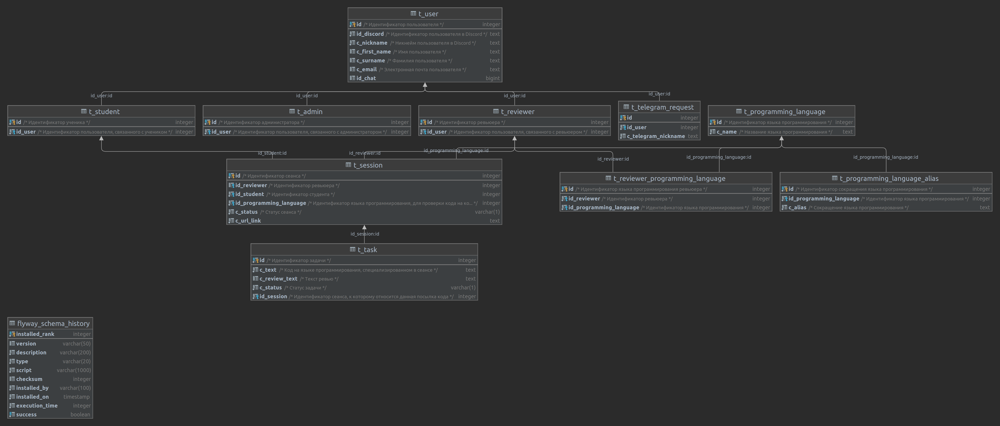

# **Wall-e** – code review bot

## Запуск сервиса
Для запуска сервиса требуется экземпляр ***PostgreSQL***, настройки подключения к которому необходимо
сконфигурировать в файле `application.yml`. Также в этом файле необходимо указать токен доступа 
к ***Discord***-боту в поле `discord.bot.token`.

При запуске сервиса требуется указать профиль `discord`, чтобы подключить интеграцию с данным сервисом.

## Схема БД
Архитектура база данных на 20.10.2021 выглядит следующим образом:

